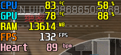

# RTSSSharedMemoryHeartShow

**RTSSSharedMemoryHeartShow** 是一个基于 [RivaTuner Statistics Server (RTSS)](https://www.guru3d.com/files-details/rtss-rivatuner-statistics-server-download.html) 的工具，依赖 [miband-heart-rate](https://github.com/Tnze/miband-heart-rate)，实现了 **小米手环心率广播** 在游戏内实时显示的功能。

它可以让你在游戏中直接看到手环心率数据：

---

## 📦 支持设备

适用于所有使用标准心率广播协议的心率设备，请参考 [miband-heart-rate](https://github.com/Tnze/miband-heart-rate)。

---

## 🚀 使用方法

### 1️⃣ 配对小米手环

1. 打开 **miband-heart-rate**。
2. 配对支持心率广播的小米手环。

---

### 2️⃣ 启动 RTSSSharedMemoryHeartShow

1. 打开 **RTSSSharedMemoryHeartShow**。
2. 程序会自动监听 `http://127.0.0.1:3030/heartrate`，获取 **miband-heart-rate** 返回的心率数据。

---

### 3️⃣ 启动游戏

  进入游戏后，心率会显示在 RTSS 叠加层中。

---

## 🙌 致谢

- [RTSS](https://www.guru3d.com/files-details/rtss-rivatuner-statistics-server-download.html)
- [miband-heart-rate](https://github.com/Tnze/miband-heart-rate)
