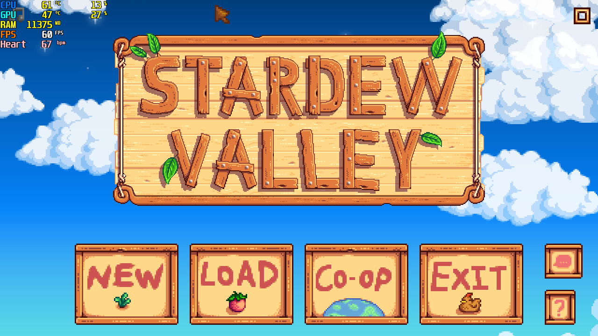
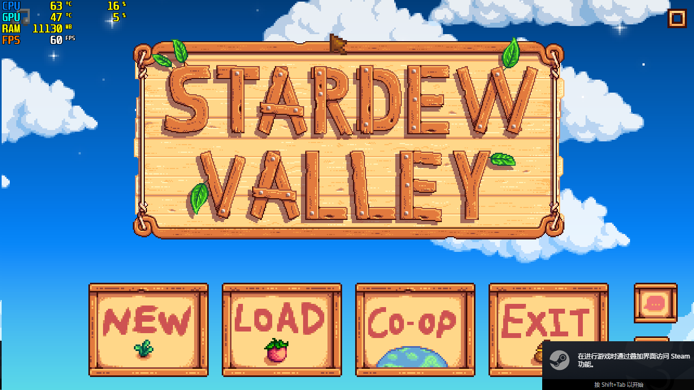
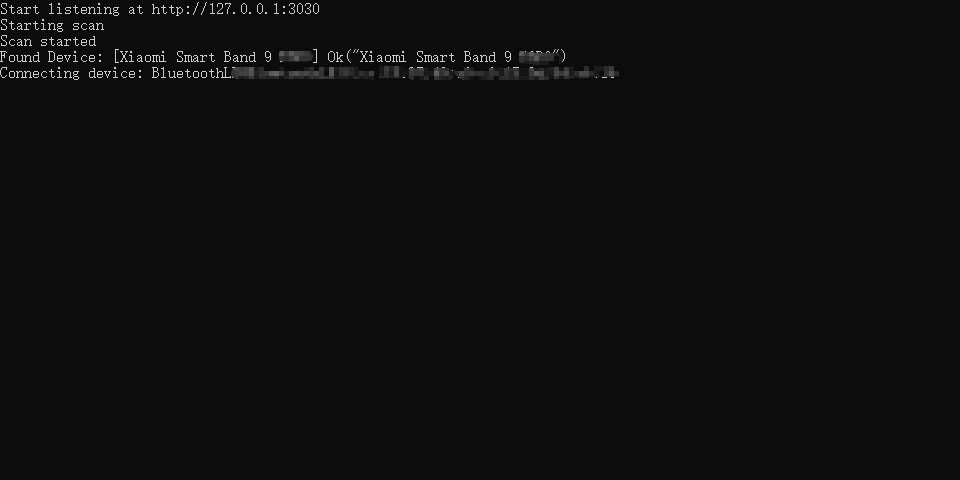
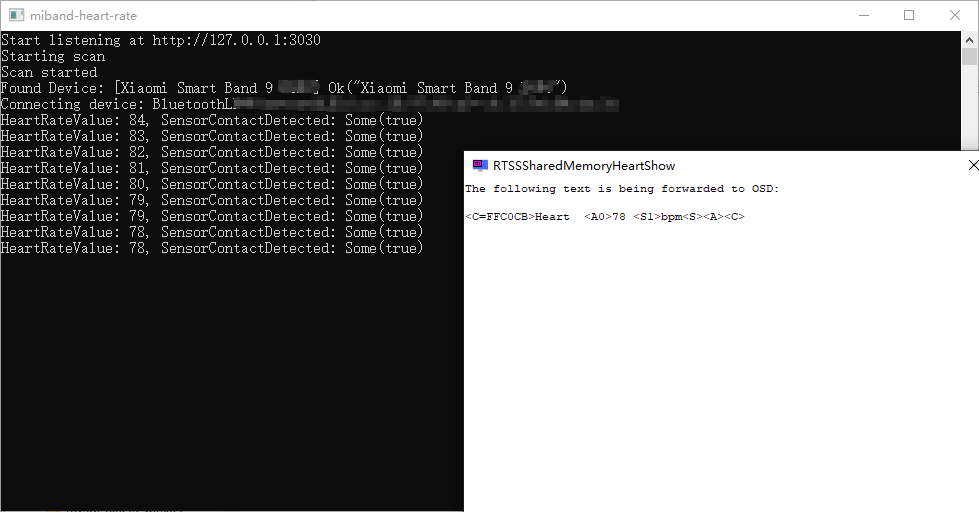

# RTSSSharedMemoryHeartShow

**RTSSSharedMemoryHeartShow** 是一个基于 [RivaTuner Statistics Server (RTSS)](https://www.guru3d.com/files-details/rtss-rivatuner-statistics-server-download.html) 的工具，依赖 [miband-heart-rate](https://github.com/Tnze/miband-heart-rate)获取心率，让心率在游戏内obs显示。

它可以让你在游戏中直接看到手环心率数据（左上角第五行）：

---

## 📦 支持设备

适用于所有使用标准心率广播协议的心率设备，请参考 [miband-heart-rate](https://github.com/Tnze/miband-heart-rate)。

---

## 🚀 使用方法

### 1️⃣ 准备

1. MSIAfterburner（微星小飞机，可选），或者其他监测工具
2. 配置RivaTuner Statistics Server，保证微星小飞机的监测数据，可以在游戏内正常显示

### 2️⃣ 配对小米手环

1. 打开 **miband-heart-rate**。
2. 配对支持心率广播的小米手环。

---

### 3️⃣ 启动 RTSSSharedMemoryHeartShow

1. 打开 **RTSSSharedMemoryHeartShow**。
2. 程序会自动监听 `http://127.0.0.1:3030/heartrate`，获取 **miband-heart-rate** 返回的心率数据。

---

### **4️⃣ 启动游戏**

进入游戏后，心率会显示在 RTSS 叠加层中。

## 

**至此，已完成全部工作！享受你的游戏吧！**

---

## 🙌 致谢

- [RTSS](https://www.guru3d.com/files-details/rtss-rivatuner-statistics-server-download.html)
- [miband-heart-rate](https://github.com/Tnze/miband-heart-rate)
